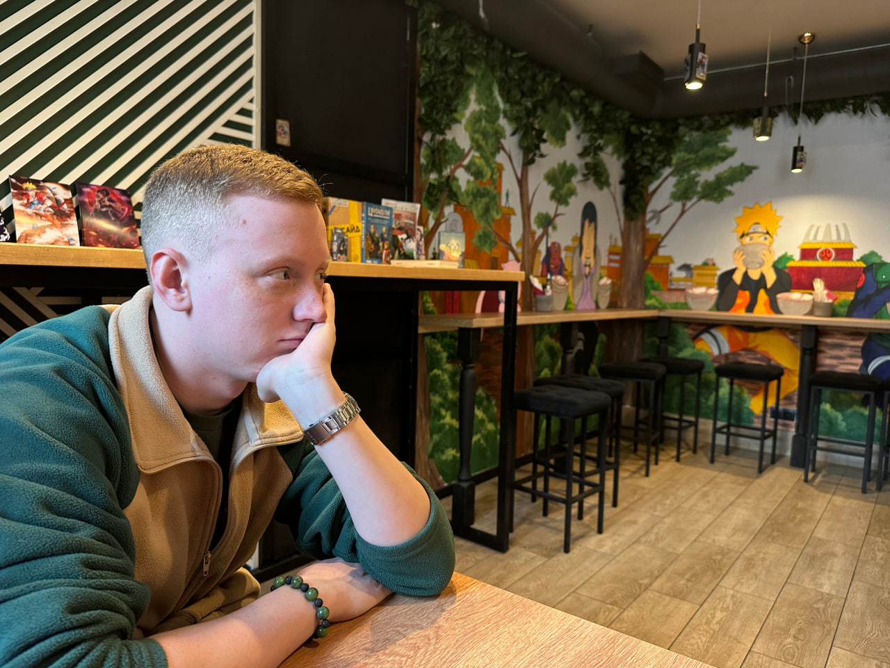

# Привет, я Севастьянов Игорь!
**Junior Web QA Engineer**
[Моё фото]

## О себе
Я начинающий веб-тестировщик, увлекаюсь изучением JavScripin и немного Python.Люблю изучать новое и принимать это на практике. На данный момент прошёл курсы Ручное тестирование веб приложений и и Git-система контроля версий

### Ключевые навыки
- Составление тест-кейсов, чек-листов, баг-репортов
- Техники тест-дизайна (эквивалентное разбиение, граничные значения)
- Инструменты: **Postman** (API тестирование), **Charles Proxy** (перехват трафика), **DevTools**
- Системы баг-трекинга: Jira, YouTrack (умею заводить баги по стандарту)
- Git / GitHub (это портфолио — пример работы с репозиторием)

### Контакты
[Telegram](https://t.me/@Agosev)
[Email](Ryo45wantage@gmail.com)
